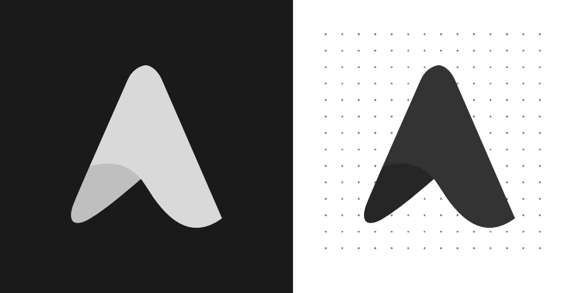

  
  
  <h3>Syte Design Resources</h3>
  
Behind the scene of a design system that make Syte better and pleasing!

  <a href="https://github.com/othneildrew/Best-README-Template"><strong>Explore the design resources »</strong></a>  
      
  
  <a href="https://github.com/syteos/">Home</a> ·
  <a href="#branding">Branding</a> ·
  <a href="#fonts">Fonts</a> ·
  <a href="#acknowledgment">Acknowledgment</a>
 

<!-- TABLE OF CONTENTS -->

  
Table of Contents

  <ol>
    <li>
      <a href="#about">About Syte Design</a>
      <ul>
        <li><a href="#built-with">Built With</a></li>
      </ul>
    </li>
    <li>
      <a href="#branding">Branding</a>
      <ul>
        <li><a href="#logo">Logo</a></li>
        <li><a href="#resources">Resources</a></li>
      </ul>
    </li>
    <li><a href="#fonts">Fonts</a></li>
    <li><a href="#acknowledgment">Acknowledgment</a></li>
  </ol>

## About

Syte design system is intended to be user & developer friendly. It follows the concept of minimalism and clean design. With several attempts in designing
the logo, Syte finally chose the correct logo of our choice. 

  
Here the comparison before & after

   
  

We remake the whole concept & added some curves on the edge to make it look modern.

### Built With

Here are the software Syte used to design almost all concept

   
  

## Branding

## Fonts

## Acknowledgment
